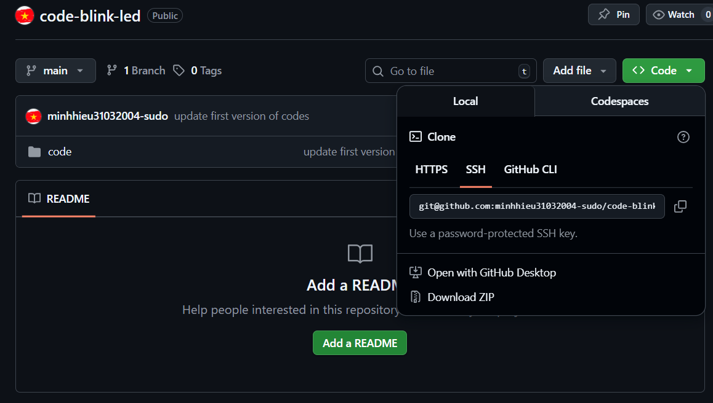

# Clone repository mới

```
git clone {link-git-ssh}
```



# Kiểm tra các file thay đổi

```
git status
```

# Add các file vào trong git

```
git add {tên-file}
```

# Commit thay đổi

```
git commit -m "this is my commit"
```

# Push lên github

```
git push
```